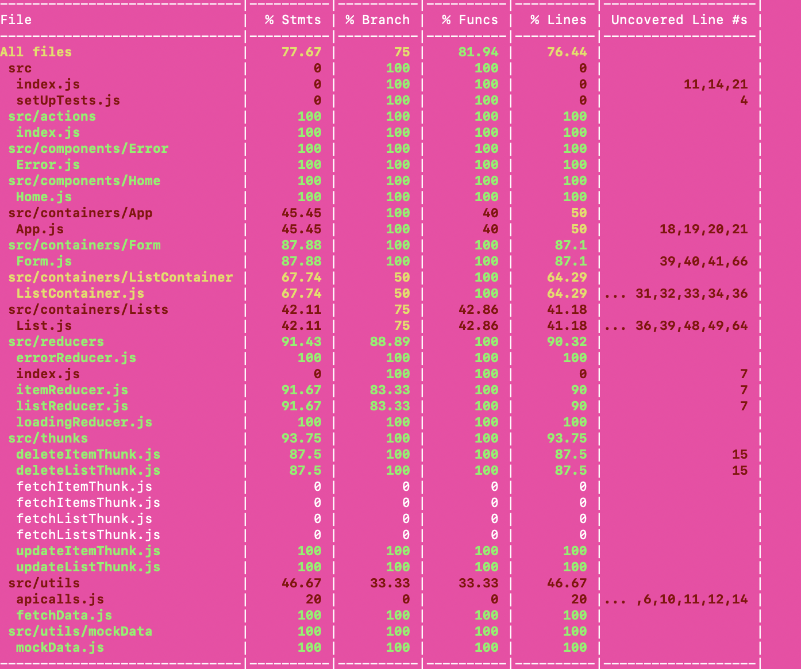
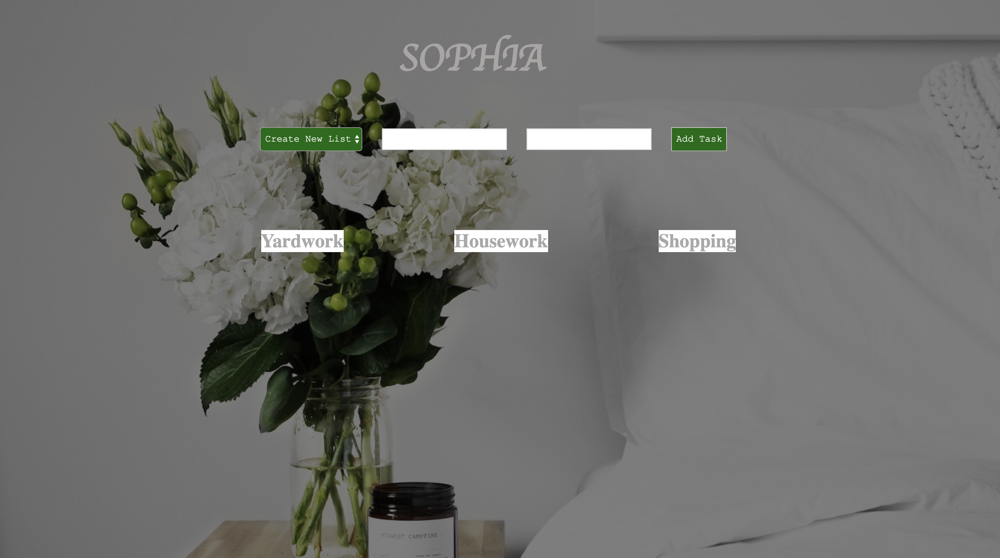
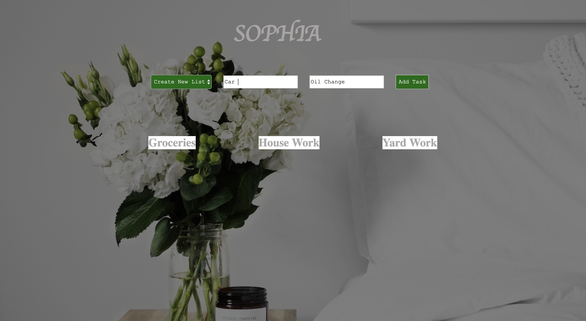
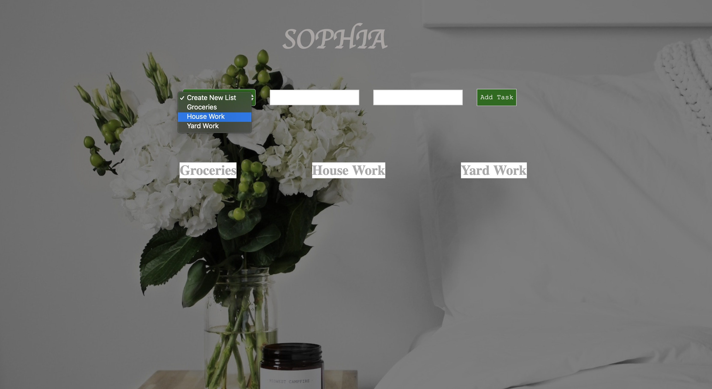
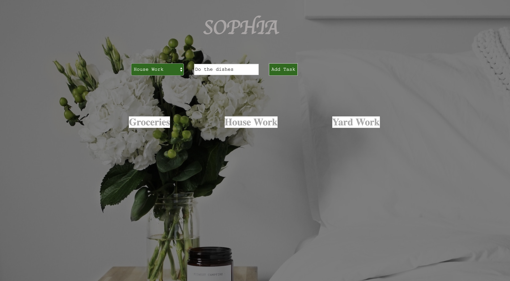

# Sophia

## Table of Contents
* [Available Scripts](#Available-Scripts)
* [Description](#Description)
* [Project Successes](Project-Successes)
* [Project Challenges](Project-Challenges)
* [Project Extensions/Issues](Project-Extensions/Issues)
* [Project Tech Emphasis](Project-Tech-Emphasis)
* [Project Comps](Project-Comps)
* [Developer](Developer)

## Available Scripts

This project was bootstrapped with [Create React App](https://github.com/facebook/create-react-app).

In the project directory, you can run:

### `npm start`

Runs the app in the development mode. 
Open [http://localhost:3000](http://localhost:3000) to view it in the browser.

The page will reload if you make edits. 
You will also see any lint errors in the console.

### `npm test`

Launches the test runner in the interactive watch mode. 
See the section about [running tests](https://facebook.github.io/create-react-app/docs/running-tests) for more information.

### Backend Server

Clone down [this repo]('https://github.com/kalex19/Sophia-server'). Start the server by running 'npm start'. Open [http://localhost:3002](http://localhost:3002) to view it in the browser.

## Description

This project is a to-do app for caregivers and seniors. An an MVP, the user is able to create a to-do list and add items to the to-do list or delete items or lists once completed. Once fully developed, the user will be able to create an acount, log in, create lists and items, complete lists and items, and star lists and items by increasing the importance of the list/item or by adding a due date to the list/item for when the to-do needs to be done and then share those lists with another user. This allows the caregiver and the senior to both have accounts - the senior creates their to-dos and the caregiver is sure to get them done.

## Project Successes

This project was developed over several days using genuine TDD. This process was exciting as real TDD rarely happens to do the difficulty of testing front-end applications. The developer also took on the challenge of building out a backend server, which proved to be successful.

## Project Challenges

 Fetching data was often a challenge and many new error messages arose, testing the developer's ability to de-bug problems. The development timeline for this project was shorter due to the test driven development. Often applications are built and then test if there is time. in this case, the tests were written, failed, the app was built, and then the code was tested and revised to match the tests. Time management was key in the completion of this project. 

## Project Extensions/Issues

* Only 77% test coverage
* User can create an account/log in
* User can share lists/items with other users
* User can star important items
* User can add a due date on items

## Project Tech Emphasis

* HTML
* CSS
* JavaScript
* React
* React Router
* Redux
* Jest
* Enzyme
* PropTypes
* ES6 Classes
* API fetches
* Thunks Middleware
* NPM

## Project Comps:

## Test Coverage

### Home Page

### Create New List

### Select List

### Add Item

### List Card

### Delete Item

### 404 Page

## Developer

[Katherine Lewis](https://github.com/kalex19)

## Licensing

All credit goes to <a href="turing.io">Turing School of Software</a> for providing the project specifications.
